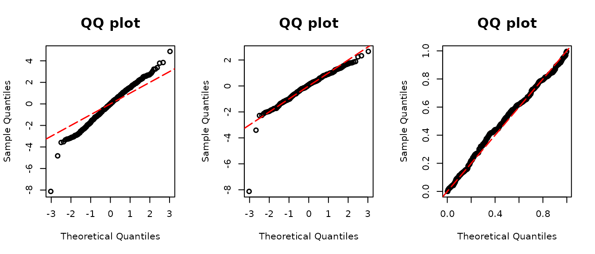

# Introduction to assessor

## assessor

The goal of assessor is to provide assessment tools for regression
models with discrete and semicontinuous outcomes proposed in Yang’s
papers on [discrete outcomes
(2024)](https://doi.org/10.1080/10618600.2024.2303336) and
[semicontinuous outcomes
(2024)](https://doi.org/10.1093/biomtc/ujae007). It calculates the
double probability integral transform (DPIT) residuals, constructs QQ
plots of residuals for model diagnostics, and constructs the ordered
curve for assessing mean structures.

### General workflow

In `assessor`, there are functions for calculating DPIT residuals for
the various type of models: discrete, zero-inflated, and semi-continuous
outcome regression models.
[`dpit()`](https://jhlee1408.github.io/assessor/reference/dpit.md) and
[`dpit_2pm()`](https://jhlee1408.github.io/assessor/reference/dpit_2pm.md)
are functions evaluating DPIT residuals for discrete, zero-inflated
discrete, semicontinuous, and two-part outcomes (the former functions
`resid_disc()`, `resid_semiconti()`, and `resid_zeroinfl()` have been
unified under
[`dpit()`](https://jhlee1408.github.io/assessor/reference/dpit.md), and
`resid_2pm()` has been renamed to
[`dpit_2pm()`](https://jhlee1408.github.io/assessor/reference/dpit_2pm.md)).
Both functions return a `dpit` object. After supplying a fitted model to
[`dpit()`](https://jhlee1408.github.io/assessor/reference/dpit.md), or
model objects or fitted probabilities to
[`dpit_2pm()`](https://jhlee1408.github.io/assessor/reference/dpit_2pm.md),
use the returned object’s methods:

- `model`:
  [`dpit()`](https://jhlee1408.github.io/assessor/reference/dpit.md)
  supports certain types of model objects.
  [`dpit_2pm()`](https://jhlee1408.github.io/assessor/reference/dpit_2pm.md)
  accepts models for the zero and positive parts or their fitted
  probabilities. Check below on which model objects are applicable.

- [`residuals()`](https://rdrr.io/r/stats/residuals.html): Use this
  accessor to obtain the numeric DPIT residual values from the returned
  object.

- [`summary()`](https://rdrr.io/r/base/summary.html): Use this method to
  summarize the DPIT residual values on the selected scale.

- [`plot()`](https://rdrr.io/r/graphics/plot.default.html): Use this
  method to draw a QQ-plot of the DPIT residuals from the returned
  object.

- `scale`: In [`residuals()`](https://rdrr.io/r/stats/residuals.html),
  [`summary()`](https://rdrr.io/r/base/summary.html), and
  [`plot()`](https://rdrr.io/r/graphics/plot.default.html), you can
  choose the scale of the residuals among `normal` and `uniform` scales.
  The sample quantiles of the residuals are plotted against the
  theoretical quantiles of a standard normal distribution under the
  normal scale, and against the theoretical quantiles of a uniform (0,1)
  distribution under the uniform scale. The default scale is `normal`.

### Real data example

The `bballHR` data included in `assessor` contain annual home run counts
and batted-ball characteristics for Major League Baseball players. The
count outcome can be fitted using either Poisson or negative binomial
regression. To assess the distributional assumption, we compare the DPIT
residuals and their QQ plots.

``` r

library(assessor)
library(MASS)
data("bballHR")


## Negative Binomial
model_formula <- HR ~ mean_exit_velo + mean_launch_angle + offset(log(AB))
modpnb <- glm.nb(model_formula, data = bballHR)
modp <- glm(model_formula, family = poisson(link = "log"), data = bballHR)

## QQ-plot
par(mfrow=c(1,3))
poi.dpit <- dpit(modp)
poi.resid <- residuals(poi.dpit, scale = "normal")
plot(poi.dpit, scale = "normal")

norm.dpit <- dpit(modpnb)
norm.resid <- residuals(norm.dpit, scale = "normal")
plot(norm.dpit, scale = "normal")

unif.dpit <- dpit(modpnb)
unif.resid <- residuals(unif.dpit, scale = "uniform")
plot(unif.dpit, scale = "uniform")
```



The left panel of the figure above presents the QQ plot of the DPIT
residuals when we use a Poisson GLM (`modp`). The residuals display a
pronounced S-shaped pattern, hinting at potential overdispersion.

The second and third panels present the of DPIT residuals of the
negative binomial regression (`modpnb`) on different scales. Both plots
align closely along the diagonal line, suggesting that the assumption of
negative binomial distribution appears appropriate. The only distinction
between them lies in the `scale` parameter of
[`plot()`](https://rdrr.io/r/graphics/plot.default.html); the middle
panel displays the plot on the normal scale, with the $`x`$ and $`y`$
axes spanning beyond (0,1), while the right panel limits the axes to a
range of 0 to 1.
