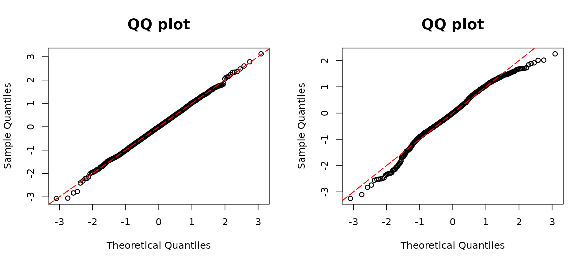

# Discrete

### Discrete outcome regression models

[`resid_disc()`](https://jhlee1408.github.io/assessor/reference/resid_disc.md)
is used for calculating the DPIT residuals for regression models with
discrete outcomes and constructing their QQ-plots. The suitable model
objects are as follows:

- Negative binomial,
  [`MASS::glm.nb()`](https://rdrr.io/pkg/MASS/man/glm.nb.html)
- Poisson, `glm(formula, family=poisson(link="log"))`
- Binary, `glm(formula, family=binomial(link="logit"))`
- Ordinal, [`MASS::polr()`](https://rdrr.io/pkg/MASS/man/polr.html)

&nbsp;

- Negative binomial
- Poisson
- Binary
- Ordinal

An example of the usage of the
[`resid_disc()`](https://jhlee1408.github.io/assessor/reference/resid_disc.md)
function for a negative binomial regression is included below. The data
are generated using a negative binomial distribution with mean
$\mu = \exp\left( \beta_{0} + X_{1}\beta_{1} + X_{2}\beta_{2} \right)$,
where $X_{1} \sim N(0,1)$, and $X_{2}$ is binary with a probability of
success as 0.7. The coefficients are set as
$\beta_{0} = - 2,\beta_{1} = 2$, and $\beta_{2} = 1$. The underlying
size parameter is 2. To assess model assumptions, one can employ a
QQ-plot generated through either `reisd_disc()` or
[`qqresid()`](https://jhlee1408.github.io/assessor/reference/qqresid.md).

``` r
library(assessor)
library(MASS)
n <- 500
set.seed(1234)
## Negative Binomial example
# Covariates
x1 <- rnorm(n)
x2 <- rbinom(n, 1, 0.7)

### Parameters
beta0 <- -2
beta1 <- 2
beta2 <- 1
size1 <- 2
lambda1 <- exp(beta0 + beta1 * x1 + beta2 * x2)

# generate outcomes
y <- rnbinom(n, mu = lambda1, size = size1)
```

``` r
par(mfrow=c(1,2))
# True model
model1 <- glm.nb(y ~ x1 + x2)
resd1 <- resid_disc(model1, plot = TRUE, scale = "normal")

# Overdispersion
model2 <- glm(y ~ x1 + x2, family = poisson(link = "log"))
resd2 <- resid_disc(model2, plot = TRUE, scale = "normal")
```

 The `model1` is correctly
specified as a GLM with a negative binomial distribution, whereas
`model2` incorrectly assumes the Poisson family, and thus overdispersion
is present. The left panel displays a diagonal QQ-plot along the
straight red line, indicative of the model assumption holding. In
contrast, the right panel deviates from a diagonal line, suggesting a
lack of adherence to the assumption. In addition, in an overdispersed
model, due to the underestimated variance, a S-shaped pattern presents
in the QQ-plot.

Similarly, we can simulate a Poisson random variable using covariates
$x_{1}$ and $x_{2}$. The true mean of $Y$ is intricately connected to
both $x_{1}$ and $x_{2}$, as expressed in the ensuing relationship:
$$Y \sim \text{Poisson}\left( \lambda = \exp\left( \beta_{0} + \beta_{1}x_{1} + \beta_{2}x_{2} \right) \right),$$
where $\beta_{0} = - 2,\ \beta_{1} = 2,\ \beta_{2} = 1$.

``` r
## Poisson example
n <- 500
set.seed(1234)
# Covariates
x1 <- rnorm(n)
x2 <- rbinom(n, 1, 0.7)

# Coefficients
beta0 <- -2
beta1 <- 2
beta2 <- 1
lambda1 <- exp(beta0 + beta1 * x1 + beta2 * x2)
y <- rpois(n, lambda1)
```

We manually enlarged three outcomes by adding values of 10, 15, and 20
to them, respectively. In the right panel, we can see the three modified
data points stand out, signaling they are potential outliers.

``` r
par(mfrow=c(1,2))
# True model
poismodel1 <- glm(y ~ x1 + x2, family = poisson(link = "log"))
resid1 <- resid_disc(poismodel1, plot = TRUE)

# Enlarge three outcomes
y <- rpois(n, lambda1) + c(rep(0, (n - 3)), c(10, 15, 20))
poismodel2 <- glm(y ~ x1 + x2, family = poisson(link = "log"))
resid2 <- resid_disc(poismodel2, plot = TRUE)
```


For the binary example, generate Bernoulli random variable, $Y$, whose
mean depends on covariates $x_{1}$ and $x_{2}$. The underlying model is
a logistic regression with the probability of 1 as
${logit}^{- 1}\left( \beta_{0} + \beta_{1}X_{1} + \beta_{2}X_{2} + \beta_{3}X_{1}X_{2} \right)$,
where
$\left( \beta_{0},\beta_{1},\beta_{2},\beta_{3} \right) = ( - 5,2,1,3)$,
$X_{1} \sim N(1,1)$, and $X_{2}$ is a dummy variable with a probability
of one equal to 0.7.

``` r
## Binary example
n <- 500
set.seed(1234)
# Covariates
x1 <- rnorm(n, 1, 1)
x2 <- rbinom(n, 1, 0.7)
# Coefficients
beta0 <- -5
beta1 <- 2
beta2 <- 1
beta3 <- 3
q1 <- 1 / (1 + exp(beta0 + beta1 * x1 + beta2 * x2 + beta3 * x1 * x2))

y1 <- rbinom(n, size = 1, prob = 1 - q1)
```

For the misspecified model, the binary covariate and the interaction
term are omitted.

``` r
par(mfrow=c(1,2))
# True model
model01 <- glm(y1 ~ x1 * x2, family = binomial(link = "logit"))
resid1 <- resid_disc(model01, plot = TRUE)

# Missing covariates
model02 <- glm(y1 ~ x1, family = binomial(link = "logit"))
resid2 <- resid_disc(model02, plot = TRUE)
```

 The true model, distinguished as
`model1`, is visually represented in the left panel, showcasing an
alignment with the red diagonal line. This alignment serves as an
indicator of the model’s adherence to the expected pattern. On the other
hand, `model2`, made without the inclusion of the variable $x_{2}$ and
the interaction, presents a deviation from the prescribed red diagonal
line.

Our
[`resid_disc()`](https://jhlee1408.github.io/assessor/reference/resid_disc.md)
function is also applicable to ordinal regression fitted by
[`MASS::polr()`](https://rdrr.io/pkg/MASS/man/polr.html). In this
experiment, we consider ordinal regression models with three levels 0,
1, and 2. Under an ordinal logistic regression model with
proportionality assumption, $P(Y \leq j) = F\left( \alpha_{j} \right),$
where $F$ is the distribution function of a logistic random variable
with mean $\beta_{1}x_{1}$. We let $\alpha_{0} = 1$, $\alpha_{1} = 4$,
$\beta_{1} = 3$, and $x_{1} \sim N(2,1)$.

``` r
## Ordinal example
n <- 500
set.seed(1234)
# Covariates
x1 <- rnorm(n, mean = 2)
# Coefficient
beta1 <- 3

# True model
p0 <- plogis(1, location = beta1 * x1)
p1 <- plogis(4, location = beta1 * x1) - p0
p2 <- 1 - p0 - p1
genemult <- function(p) {
  rmultinom(1, size = 1, prob = c(p[1], p[2], p[3]))
}
test <- apply(cbind(p0, p1, p2), 1, genemult)
y1 <- rep(0, n)
y1[which(test[1, ] == 1)] <- 0
y1[which(test[2, ] == 1)] <- 1
y1[which(test[3, ] == 1)] <- 2
multimodel <- polr(as.factor(y1) ~ x1, method = "logistic")
```

    We then generate data under the scenario where the assumption of proportionality is not met, which is a common issue for ordinal regression models. 

Specifically, $P(Y \leq 0) = F\left( \alpha_{0} \right)$ as described
above whereas $P(Y \leq 1) = F_{1}\left( \alpha_{1} \right)$, where
$F_{1}$ is the distribution function of a logistic random variable with
mean $\beta_{2}x_{1}$ and we set $\beta_{2} = 1$. The data are
incorrectly fit with a proportional odds model.

``` r
## Non-Proportionality
n <- 500
set.seed(1234)
x1 <- rnorm(n, mean = 2)
beta1 <- 3
beta2 <- 1
p0 <- plogis(1, location = beta1 * x1)
p1 <- plogis(4, location = beta2 * x1) - p0 
p2 <- 1 - p0 - p1
genemult <- function(p) {
  rmultinom(1, size = 1, prob = c(p[1], p[2], p[3]))
}
test <- apply(cbind(p0, p1, p2), 1, genemult)
y1 <- rep(0, n)
y1[which(test[1, ] == 1)] <- 0
y1[which(test[2, ] == 1)] <- 1
y1[which(test[3, ] == 1)] <- 2
multimodel2 <- polr(as.factor(y1) ~ x1, method = "logistic")
```

``` r
par(mfrow=c(1,2))
resid1 <- resid_disc(multimodel, plot = TRUE)
resid2 <- resid_disc(multimodel2, plot = TRUE)
```

 As a result, when
considering the diagnostic assessment through QQ-plots, `model1`
exhibits a diagonal QQ-plot, indicating a favorable alignment with the
underlying assumptions. In contrast, the QQ-plot associated with
`model2` deviates from the expected diagonal line, suggesting a
departure from the idealized model assumptions. This discrepancy
underscores the importance of careful consideration and inclusion of
relevant variables in model specification to ensure the robustness and
validity of statistical models.
