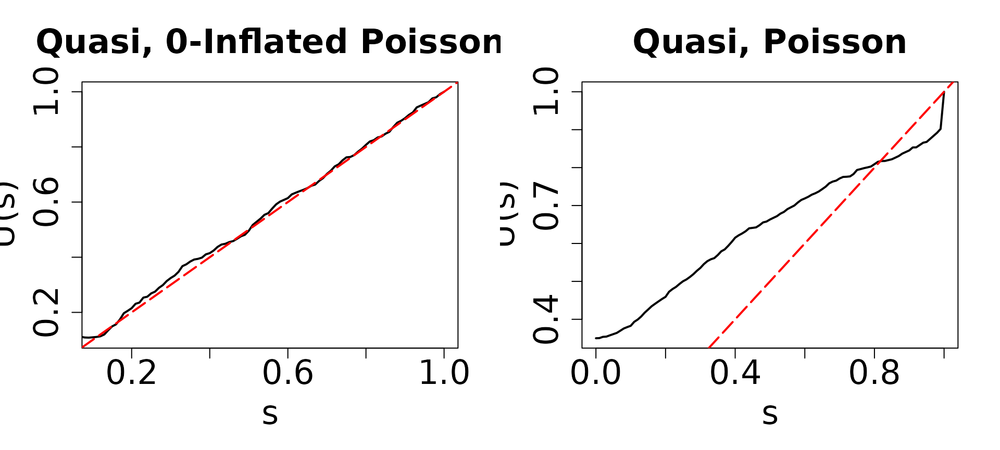

# Quasi Emprical residuals functions

### Discrete outcome regression

[`resid_quasi()`](https://jhlee1408.github.io/assessor/reference/resid_quasi.md)
generates QQ-plots for regression models with discrete outcomes,
employing quasi-empirical residual distribution functions. It’s tailored
to assess model assumptions in GLMs featuring binary, ordinal, Poisson,
negative binomial, zero-inflated Poisson, and zero-inflated negative
binomial outcomes. Unlike typical functions in `assessor` package,
[`resid_quasi()`](https://jhlee1408.github.io/assessor/reference/resid_quasi.md)
exclusively focuses on plotting QQ-plots and does not compute DPIT
residuals.

- Negative binomial,
  [`MASS::glm.nb()`](https://rdrr.io/pkg/MASS/man/glm.nb.html)
- Poisson, `glm(formula, family=poisson(link="log"))`
- Binary, `glm(formula, family=binomial(link="logit"))`
- Ordinal, [`MASS::polr()`](https://rdrr.io/pkg/MASS/man/polr.html)
- Zero-Inflated Poisson, `pscl::zeroinfl(dist = "poisson")`
- Zero-Inflated negative binomial, `pscl::zeroinfl(dist = "negbin")`

The tabs below explain how to interpret the QQ-plots generated by
resid_quasi() in Poisson and Zero-inflated Poisson examples,
respectively.

- Poisson example
- Zero-Inflation Poisson

We simulate a Poisson random variable using covariates $X_{1}$ and
$X_{2}$. The true mean of $Y$ is intricately connected to both $X_{1}$
and $X_{2}$, as expressed in the ensuing relationship:
$$Y \sim \text{Poisson}\left( \lambda = \exp\left( \beta_{0} + \beta_{1}x_{1} + \beta_{2}x_{2} \right) \right),$$
where $\beta_{0} = - 2,\ \beta_{1} = 2,\ \beta_{2} = 1$.

``` r
library(assessor)
## Poisson example
n <- 500
set.seed(1234)
# Covariates
x1 <- rnorm(n)
x2 <- rbinom(n, 1, 0.7)

# Coefficients
beta0 <- -2
beta1 <- 2
beta2 <- 1
lambda1 <- exp(beta0 + beta1 * x1 + beta2 * x2)
y <- rpois(n, lambda1)
```

``` r
# True model
poismodel1 <- glm(y ~ x1 + x2, family = poisson(link = "log"))
resid_quasi(poismodel1)
#> Multistart 1 of 1 |Multistart 1 of 1 |Multistart 1 of 1 |Multistart 1 of 1 /Multistart 1 of 1 |Multistart 1 of 1 |                   
```

 The figure presented
above represents the results of `poismodel1`, which is a GLM fitted with
a Poisson distribution. In this context, the variable `y` follows a
Poisson distribution as defined in the model. Our expectation was that
the QQ-plot would exhibit alignment with diagonal lines, as this
alignment indicates conformity with the assumptions of the Poisson
distribution for discrete outcome regression.

As anticipated, the result indeed demonstrates a well-aligned QQ plot,
closely following the diagonal line. This alignment is indicative of the
correctness of our model assumption regarding the distribution of the
outcome variable. In simpler terms, it suggests that our model is
appropriately capturing the characteristics of the data, specifically
the discrete nature of the outcomes, as dictated by the Poisson
distribution.

We generate simulated data using a zero-inflated Poisson model. The
probability of excess zeros is modeled using
${logit}\left( p_{0} \right) = \beta_{00} + \beta_{10}X_{1}$, while the
Poisson component has a mean of
$\lambda = \exp\left( \beta_{0} + \beta_{1}X_{1} + \beta_{2}X_{2} \right)$.
Here, $X_{1}$ follows a normal distribution with mean 0 and standard
deviation 1, and $X_{2}$ is a binary variable with a probability of 1
set to 0.7. The parameter values are set to
$\left( \beta_{00},\beta_{10},\beta_{0},\beta_{1},\beta_{2} \right) = ( - 2,2, - 2,2,1)$.

``` r
## Zero-Inflated Poisson
library(assessor)
library(pscl)
n <- 500
set.seed(1234)
# Covariates
x1 <- rnorm(n)
x2 <- rbinom(n, 1, 0.7)
# Coefficients
beta0 <- 0.5
beta1 <- 2
beta2 <- 1
beta00 <- -2
beta10 <- 2

# Mean of Poisson part
lambda1 <- exp(beta0 + beta1 * x1 + beta2 * x2)
# Excess zero probability
p0 <- 1 / (1 + exp(-(beta00 + beta10 * x1)))
## simulate outcomes
y0 <- rbinom(n, size = 1, prob = 1 - p0)
y1 <- rpois(n, lambda1)
y <- ifelse(y0 == 0, 0, y1)
```

``` r
par(mfrow=c(1,2))
## True model
modelzero1 <- zeroinfl(y ~ x1 + x2 | x1, dist = "poisson", link = "logit")
resid_quasi(modelzero1)
#> Multistart 1 of 1 |Multistart 1 of 1 |Multistart 1 of 1 |Multistart 1 of 1 /Multistart 1 of 1 |Multistart 1 of 1 |                   

## Zero inflation
modelzero2 <- glm(y ~ x1 + x2, family = poisson(link = "log"))
resid_quasi(modelzero2)
#> Multistart 1 of 1 |Multistart 1 of 1 |Multistart 1 of 1 |Multistart 1 of 1 /Multistart 1 of 1 |Multistart 1 of 1 |                   
```

 The QQ plots shown above correspond
to `modelzero1` and `modelzero2`. Given that the true distribution of
`y` follows a zero-inflated Poisson distribution, we expect to see
deviations from the diagonal line in the QQ plot of `modelzero2`. As
anticipated, the QQ plot on the left closely follows the diagonal line.
However, in the right panel, both the left and right tails of the QQ
plot for `modelzero2` deviate from the diagonal line, indicating that
the assumption of a Poisson distribution may not be accurate.

The observed differences in the QQ plot of `modelzero2` suggest that the
assumption of a Poisson distribution is not well-supported by the data.
This underscores the importance of considering alternative
distributional assumptions, such as the zero-inflated Poisson
distribution, which may better capture the characteristics of the
simulated data.
