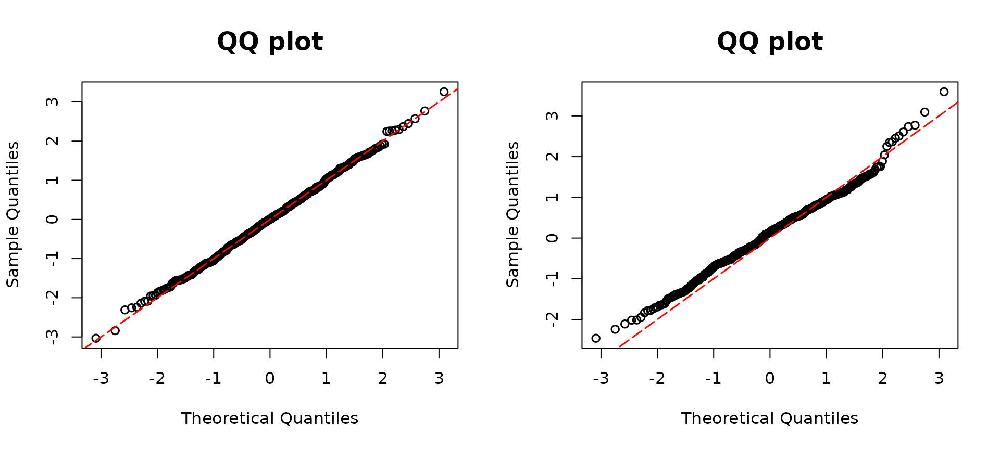

# Semicontinuous

### Semicontinuous outcome regression models

[`dpit()`](https://jhlee1408.github.io/assessor/reference/dpit.md) is
used for calculating the DPIT residuals for regression models with
semicontinuous outcomes, and
[`plot()`](https://rdrr.io/r/graphics/plot.default.html) constructs
corresponding QQ-plots from the returned objects. Specifically, a Tobit
regression and a Tweedie regression model are suitable models for
[`dpit()`](https://jhlee1408.github.io/assessor/reference/dpit.md). The
suitable model objects are as follows:

- Tweedie, `glm(family= tweedie())`
- Tobit(VGAM), [`VGAM::vglm()`](https://rdrr.io/pkg/VGAM/man/vglm.html)
- Tobit(AER), [`AER::tobit()`](https://rdrr.io/pkg/AER/man/tobit.html)

&nbsp;

- Tweedie
- Tobit

We simulate `y1` to follow Tweedie distribution depending on covariates
`x11` and `x12`.

``` r

## Tweedie model
library(assessor)
library(tweedie)
library(statmod)
n <- 500
x11 <- rnorm(n)
x12 <- rnorm(n)
beta0 <- 5
beta1 <- 1
beta2 <- 1
lambda1 <- exp(beta0 + beta1 * x11 + beta2 * x12)
y1 <- rtweedie(n, mu = lambda1, xi = 1.6, phi = 10)
```

In constructing `model2`, the intentional omission of the covariate
`x12` was aimed at facilitating a direct comparison with the true model,
`model1`. As expected, the QQ plot in the right panel corresponding to
`model2` exhibits a substantial deviation from the diagonal line,
attributing this deviation to the deliberate omission. Conversely, the
left panel shows a closer alignment along the diagonal, implying a
better fit when including both covariates, `x11` and `x12`. This outcome
strongly suggests that incorporating all covariates results in a more
appropriate and improved model.

``` r

# True model
model1 <-
  glm(y1 ~ x11 + x12,
    family = tweedie(var.power = 1.6, link.power = 0)
  )

# missing covariate
model2 <-  glm(y1 ~ x11 ,
    family = tweedie(var.power = 1.6, link.power = 0)
  )

par(mfrow=c(1,2))
dpit1 <- dpit(model1)
resid1 <- residuals(dpit1, scale = "normal")
plot(dpit1, scale = "normal")

dpit2 <- dpit(model2)
resid2 <- residuals(dpit2, scale = "normal")
plot(dpit2, scale = "normal")
```



[`dpit()`](https://jhlee1408.github.io/assessor/reference/dpit.md)
function supports calculating DPIT residuals for a Tobit regression from
both [`VGAM::vglm`](https://rdrr.io/pkg/VGAM/man/vglm.html) and
[`AER::tobit`](https://rdrr.io/pkg/AER/man/tobit.html) packages.

In this example, we assume that the latent variable $`Y^*`$ follows a
normal distribution with a mean given by
``` math
\mu=\beta_0+\beta_1X_1+\beta_2X_2, 
```
where $`X_1, X_2 \sim Unif (0, 1)`$ independently, and
$`\beta_0 = 1, \beta_1 = -3,
 \beta_2 = 3`$. We observe $`Y=0`$ if $`Y^*<0`$. These variables will be
employed as inputs for Tobit regression analyses provided by the `VGAM`
and `AER` packages.

``` r

## Tobit regression model
library(VGAM)
beta13 <- 1
beta14 <- -3
beta15 <- 3

set.seed(123)
x11 <- runif(n)
x12 <- runif(n)
lambda1 <- beta13 + beta14 * x11 + beta15 * x12
sd0 <- 0.3
yun <- rnorm(n, mean = lambda1, sd = sd0)
y <- ifelse(yun >= 0, yun, 0)
```

The model `fit1miss`, corresponding to the right QQ plot, intentionally
omits the covariate x12. This omission leads to a deviation from the
diagonal line in the QQ plot, observed in the right panel. Thus, it can
be interpreted as the model misspecification. In contrast, the left
panel, corresponding to the model including all covariates, aligns
closely along the diagonal line.

``` r

# Using VGAM package
# True model
fit1 <- vglm(formula = y ~ x11 + x12, tobit(Upper = Inf, Lower = 0, lmu = "identitylink"))
# Missing covariate
fit1miss <- vglm(formula = y ~ x11, tobit(Upper = Inf, Lower = 0, lmu = "identitylink"))

par(mfrow=c(1,2))
dpit1 <- dpit(fit1)
resid1 <- residuals(dpit1, scale = "normal")
plot(dpit1, scale = "normal")

dpit2 <- dpit(fit1miss)
resid2 <- residuals(dpit2, scale = "normal")
plot(dpit2, scale = "normal")
```


The interpretation remains the same as the `VGAM` example. Note that the
results from the `AER` are exactly the same as those from the `VGAM`
example.

``` r

# Using AER package
library(AER)
# True model
fit2 <- tobit(y ~ x11 + x12, left = 0, right = Inf, dist = "gaussian")
# Missing covariate
par(mfrow=c(1,2))
fit2miss <- tobit(y ~ x11, left = 0, right = Inf, dist = "gaussian")
dpit1 <- dpit(fit2)
resid1 <- residuals(dpit1, scale = "normal")
plot(dpit1, scale = "normal")

dpit2 <- dpit(fit2miss)
resid2 <- residuals(dpit2, scale = "normal")
plot(dpit2, scale = "normal")
```


